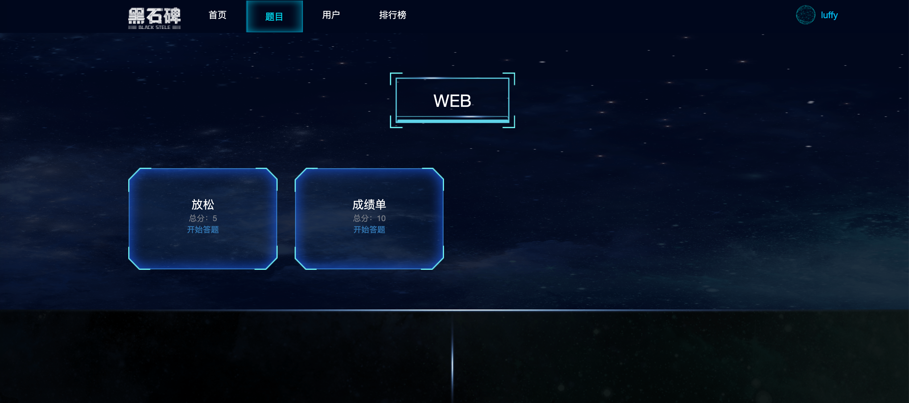
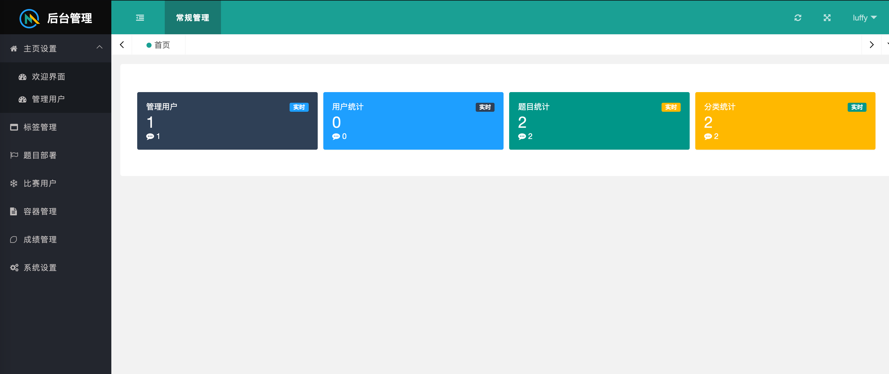

# 🐒黑石碑系统

**项目正在快速迭代中，请即时更新源代码 [源地址](http://www.github.com/thunderbarca/BlackStone)**


## 0x01 🍉功能介绍
该平台是一个CTF比赛平台，可用于企业进行内部人员进行CTF竞赛以及培训.

目前平台还在持续开发中。如果对你有帮助，可以帮我点亮小星星，这对我非常重要。

## 0x02 🥝系统结构

### 开发框架

基础语言: **Python(3.9.1)**

Web框架: **django(3.1.5)**

数据库: **Postgresql 13**

前端: **Layu-imini**


## 0x03 🍓功能介绍

**前台页面**


**管理页面**


## 0x04 🖨安装教程

### 0x001 一键部署

我把步骤都写在shell脚本里

debian系用户(Debian, Ubuntu)建议运行debian_run.sh，会使用国内源进行安装
```bash
git clone http://www.github.com/thunderbarca/BlackStone.git
cd BlackStone
source shell/debian_run.sh
```

Kali用户使用shell/kali_run.sh
```bash
git clone http://www.github.com/thunderbarca/BlackStone.git
cd BlackStone
source shell/kali_run.sh
```

红帽系操作系统(包括redhat, fedora, centos)请用redhat_run.sh
```bash
git clone http://www.github.com/thunderbarca/BlackStone.git
cd BlackStone
source shell/redhat_run.sh
```

### 0x002 正式启动系统(开发模式)
```bash
source ~/.bashrc
python3 manager.py runserver 0.0.0.0:8000
```

默认的用户名和密码是luffy:shadow

## 0x05 ⏰长期更新
- [ ] 各视图的协调优化以及BUG修复
- [ ] 前台成绩刷新改成websocket

## 0x06 🤝外链
如果你觉得有趣的话，可以关注我的公众号。


## 0x07 🎛题目部署
详情请参阅[部署](doc/DEPLOY.md)


## 0x08 🏓版权协议
该项目签署了GPL-3.0授权许可，详情请参阅[COPING](doc/COPYING)。