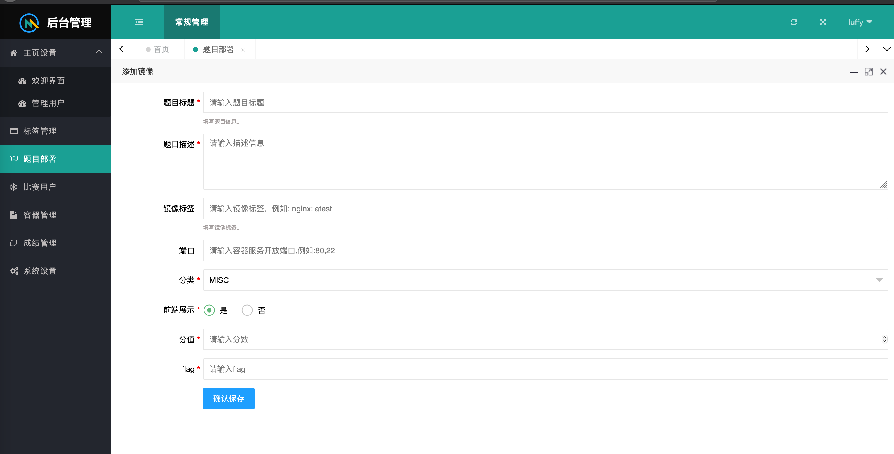

# 镜像部署文档
0x01 平台地址:http://127.0.0.1:8000/back/login 默认账户 luffy:shadow

0x02 要想自己部署题目，必须有docker经验，将题目封装在docker中，镜像对外开放一个或多个端口.

0x03 比赛者在启动题目时平台会自动将内网的端口映射到宿主机的随机端口上，端口范围在10000-20000之间，请务必确认该区间的端口没有被占用。

0x04 题目部署时平台会先在本地寻找镜像，如果找不到则从仓库中下载，如果仓库中也没有平台则会报错

0x05 部署时 题目部署->添加 

这里面需要注意的只有两个地方
镜像标签就是docker的标签，比如nginx:latest
端口号则是docker镜像开放的端口，采用的形式可以是80或者是80,22。